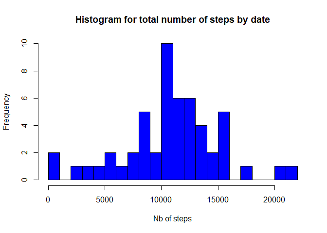

This assignment makes use of data from a personal activity monitoring
device. This device collects data at 5 minute intervals through out the
day. The data consists of two months of data from an anonymous
individual collected during the months of October and November, 2012 and
include the number of steps taken in 5 minute intervals each day.

Motive of this assignment to provide a detail analysis of give activity
data.

Loading and preprocessing the data
----------------------------------

The data is loaded from given zip file and columns are renamed for
better understanding.

    activity <- read.csv(unzip("activity.zip"),header=TRUE,sep=",",stringsAsFactors = FALSE)
    names(activity) <- c("Steps","ActivityDate","TimeInterval")

We will use R's dplyr and lubridate package for data processing.

    library(dplyr)

    ## 
    ## Attaching package: 'dplyr'

    ## The following objects are masked from 'package:stats':
    ## 
    ##     filter, lag

    ## The following objects are masked from 'package:base':
    ## 
    ##     intersect, setdiff, setequal, union

    library(lubridate)

    ## 
    ## Attaching package: 'lubridate'

    ## The following object is masked from 'package:base':
    ## 
    ##     date

Date is saves as character variable. We will transform Date variable to
Date format. Some dates variable has NAs, so we will get rid of those
values.

    table_activity <-tbl_df(activity)
    table_activity <- table_activity %>% mutate(ActivityDate = ymd(ActivityDate), TimeInterval=sprintf("%04d",TimeInterval))
    table_activity_Clean <- filter(table_activity,complete.cases(table_activity))

What is mean total number of steps taken per day?
-------------------------------------------------

To answer this question, we perform two tasks:  
\* Group the data by ActivityDate  
\* Merge the data and calculate the \# of steps/day

    TotalStepsPerDay <- aggregate(list(NbSteps = table_activity_Clean$Steps), by = list(ActivityDate=table_activity_Clean$ActivityDate),FUN = sum)
    meanSteps <- mean(TotalStepsPerDay$NbSteps)
    medianSteps <- median(TotalStepsPerDay$NbSteps)

Mean of total number of steps/days is : 1.076618910^{4}  
Median of total number of steps/day is : 10765

    hist(TotalStepsPerDay$NbSteps,breaks=seq(0,22000,1000),col="blue",main="Histogram for total number of steps by date", xlab="Nb of steps")

What is the average daily activity pattern?
-------------------------------------------

1.Time series plot (type = "l") of the 5-minute interval (x-axis) and
the average number of steps taken, averaged across all days (y-axis)

    AvgStepsPerTimePeriod <- aggregate(list(NbSteps = table_activity_Clean$Steps), by = list(TimeInterval=table_activity_Clean$TimeInterval),FUN = mean)
    AvgStepsPerTimePeriod <- aggregate(list(NbSteps = table_activity_Clean$Steps), by = list(TimeInterval=table_activity_Clean$TimeInterval),FUN = mean)
    with(AvgStepsPerTimePeriod,plot(NbSteps ~TimeInterval, xlab="Time interval", ylab="No. of steps", type="l", main="Total number of steps across day time"))

1.  Which 5-minute interval, on average across all the days in the
    dataset, contains the maximum number of steps?

<!-- -->

    AvgStepsSorted <- arrange(AvgStepsPerTimePeriod, desc(NbSteps))
    timeIntervel <- AvgStepsSorted$TimeInterval[1]
    maxSteps <- AvgStepsSorted$NbSteps[1]

0835 has the maximum number 206.1698113 of steps.

Imputing missing values
-----------------------

There are a number of days/intervals where there are missing values
(coded as NA). The presence of missing days may introduce bias into some
calculations or summaries of the data.

1.  Below code colculate the total number of missing values in the
    dataset.

<!-- -->

    table_activity_Missing <- filter(table_activity,!complete.cases(table_activity))
    NbMissingValues = dim(table_activity_Missing)[1] 

Total numberof missing values in Activity dataset are: 2304

1.  We will replace the non-NA values is to compute the mean value for
    each 5-minutes period over all the activity dates. To do that, we
    will use the data frame AvgStepsPerTimePeriod defined above, and
    join it with the original data frame table\_activity. Then we will
    replace, in the original column steps, the NA values with mean value
    of steps given in the data frame AvgStepsPerTimePeriod.

<!-- -->

    MergeDF <- inner_join(AvgStepsPerTimePeriod,table_activity, by= c("TimeInterval"))
    MergeDF <- MergeDF %>% mutate(Steps = ifelse(is.na(Steps), NbSteps,Steps))

1.  A new dataset that is equal to the original dataset but with the
    missing data filled in.

<!-- -->

    TotalStepsPerDayNew <- aggregate(list(stepsUpdated = MergeDF$Steps), by = list(ActivityDate=MergeDF$ActivityDate),FUN = sum)
    print(summary(TotalStepsPerDayNew))

    ##   ActivityDate         stepsUpdated  
    ##  Min.   :2012-10-01   Min.   :   41  
    ##  1st Qu.:2012-10-16   1st Qu.: 9819  
    ##  Median :2012-10-31   Median :10766  
    ##  Mean   :2012-10-31   Mean   :10766  
    ##  3rd Qu.:2012-11-15   3rd Qu.:12811  
    ##  Max.   :2012-11-30   Max.   :21194

The mean and median values are now identical. This means that our
transformation smoothed the values.

    hist(TotalStepsPerDayNew$stepsUpdated,breaks=seq(0,22000,1000),col="blue",main="Histogram for total number of steps by date", xlab="No. of steps")

Are there differences in activity patterns between weekdays and weekends?
-------------------------------------------------------------------------

1.  Create a new factor variable in the dataset with two levels –
    “weekday” and “weekend” indicating whether a given date is a weekday
    or weekend day.

<!-- -->

    MergeDF_WDay <- MergeDF %>% mutate(WDay_WE = as.factor(ifelse(wday(ActivityDate) %in% c(1,7),"Week-End","WeekDay")))

1.  Make a panel plot containing a time series plot (i.e. type="l") of
    the 5-minute interval (x-axis) and the average number of steps
    taken, averaged across all weekday days or weekend days (y-axis).

<!-- -->

    library(ggplot2)
    MergeDF_WDay <- MergeDF %>% mutate(WDay_WE = as.factor(ifelse(wday(ActivityDate) %in% c(1,7),"Week-End","WeekDay")))
    MergeDF_WDay_Mean <- aggregate(list(Steps = MergeDF_WDay$Steps), by = list(WDay_WE =MergeDF_WDay$WDay_WE,TimeInterval=MergeDF_WDay$TimeInterval),FUN = mean)

    g1 <- ggplot(MergeDF_WDay_Mean, aes(x=TimeInterval,y=Steps))
    g1 <- g1 + geom_point() + facet_grid(.~WDay_WE) + theme(strip.background = element_rect(colour="black", fill="BlanchedAlmond", size=1.5, linetype="solid"),
                                                       panel.background= element_rect(fill="white", linetype="solid",colour="black")) 
    g1 <- g1 + facet_wrap(~WDay_WE,nrow = 2) + scale_x_discrete(name="Interval", breaks = c(0,500,1000,1500,2000,2500),labels = c(0,500,1000,1500,2000,2500))
    print(g1)

